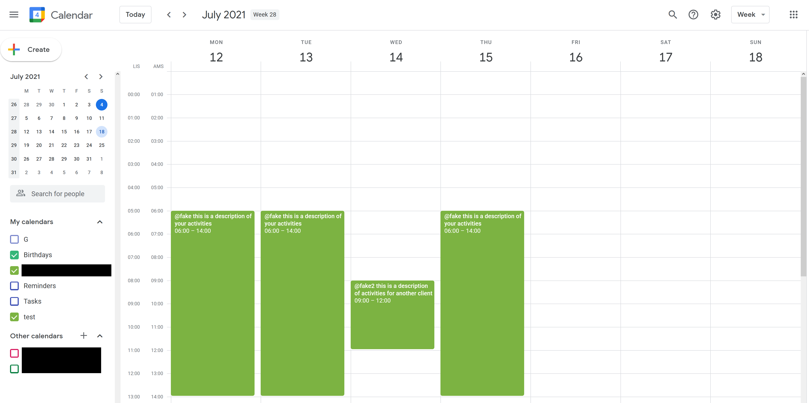
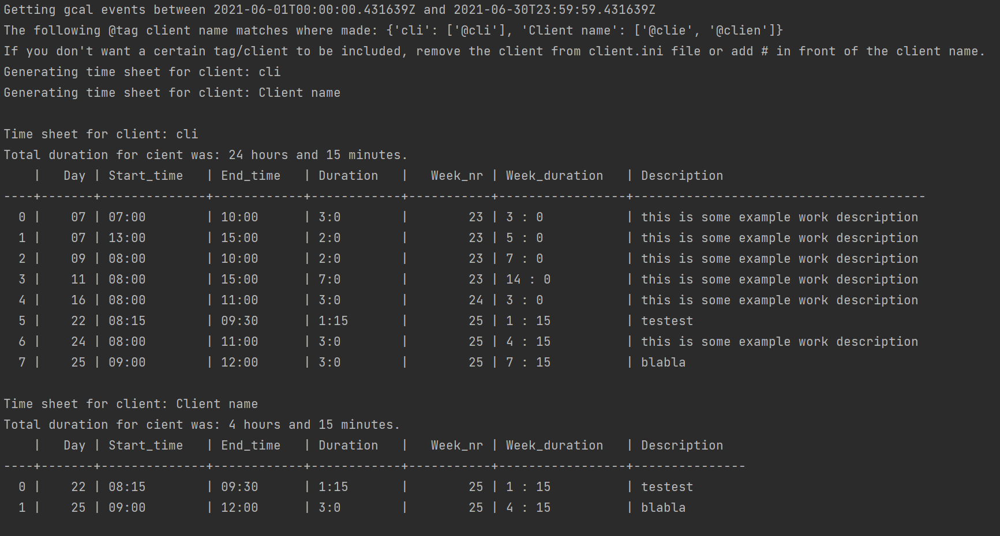

# TimeSheeterPython
Generates a timesheet based on Google Calendar events that contain "@clientname" in their description.

# About:
This script downloads Google calendar events, finds all events with a "@clientname" tag and generates a 
time sheet table with: 
`| Day of month | Start_time | End_time | Duration | Week_nr | Week_duration | Description`

Registering your worked hours could look something like the screenshot below. The @fake and @fake2 correspond to client name abbreviations.
Full client names are stored in a clients.ini file (if the full name in the ini file is "Faker Client" it will automatically be matched to the @fake tag and Fake2fake to the @fake2 tag).



The output can be a ascii table or a pdf based on a .docx template (work in progress).
An example of the output (not corresponding to the above Google Calendar example): 



# Setup: 

To make this script work, install all dependencies in your python environment. 

The first time you run this script a browser should pop up with a Google auth flow. 
This should generate a token.pickle file in the same directory as this script. 

You might have to fiddle around with settings in https://developers.google.com/calendar/ to allow your Google calendar to be accessed through the API.

Important note: the ID of the calendar that will be used to generate the report is hard coded into 
TimeSheeter.py at line 142 at the moment (sorry). Selection by calendar name is on my TODO list. 

You can find this calendar ID when you go to google calendar (each calendar has it's own ID)
Look for something like: 
`CalID = 'xaop.com_g28392fnl23j23f23fh2jk@group.calendar.google.com'`

# Usage: 

```
python TimeSheeter.py -h
usage: TimeSheeter.py [-h] [-s START] [-e END] [-l] [-t] [-w] [-r]

optional arguments:
  -h, --help                show this help message and exit
  -s START, --start START   Start date. Script will assume time of day 0:00:00 unless otherwise specified.
  -e END, --end END         End date. Script will assume time of day 23:59:59 unless otherwise specified.
  -l, --last                Generate time sheet for all of last month.
  -t, --this                Generate time sheet for all of this month.
  -w, --weektotals          Add week numbers and totals per week to report.
  -r, --report              Generate a .pdf report based on the .docx template file in this directory.
```

Example to generate a timesheet for all of last month: 
```
python TimeSheeter.py -l
Getting gcal events between 2021-06-01T00:00:00.198112Z and 2021-06-30T23:59:59.198112Z
The following @tag client name matches where made: {'Client name': ['@cli', '@clie', '@clien']}
If you don't want a certain tag/client to be included, remove the client from client.ini file or add # in front of the client name.
Generating time sheet for client: Client name

Time sheet for client: Client name
Total duration for cient was: 24 hours and 15 minutes.
    |   Day | Start_time   | End_time   | Duration   |   Week_nr | Week_duration   | Description
----+-------+--------------+------------+------------+-----------+-----------------+---------------------------------------
  0 |    07 | 07:00        | 10:00      | 3:0        |        23 | 3 : 0           | this is some example work description
  1 |    07 | 13:00        | 15:00      | 2:0        |        23 | 5 : 0           | this is some example work description
  2 |    09 | 08:00        | 10:00      | 2:0        |        23 | 7 : 0           | this is some example work description
  3 |    11 | 08:00        | 15:00      | 7:0        |        23 | 14 : 0          | this is some example work description
  4 |    16 | 08:00        | 11:00      | 3:0        |        24 | 3 : 0           | this is some example work description
  5 |    22 | 08:15        | 09:30      | 1:15       |        25 | 1 : 15          | testest
  6 |    24 | 08:00        | 11:00      | 3:0        |        25 | 4 : 15          | this is some example work description
  7 |    25 | 09:00        | 12:00      | 3:0        |        25 | 7 : 15          | blabla

```

Example to generate timesheet for custom period: 
````
python TimeSheeter.py -s 09-06-2021 -e 24-06-2021
Getting gcal events between 2021-06-09T00:00:00Z and 2021-06-24T00:00:00Z
The following @tag client name matches where made: {'Client name': ['@cli', '@clie']}
If you don't want a certain tag/client to be included, remove the client from client.ini file or add # in front of the client name.
Generating time sheet for client: Client name

Time sheet for client: Client name
Total duration for cient was: 13 hours and 15 minutes.
    |   Day | Start_time   | End_time   | Duration   |   Week_nr | Week_duration   | Description
----+-------+--------------+------------+------------+-----------+-----------------+---------------------------------------
  0 |    09 | 08:00        | 10:00      | 2:0        |        23 | 2 : 0           | this is some example work description
  1 |    11 | 08:00        | 15:00      | 7:0        |        23 | 9 : 0           | this is some example work description
  2 |    16 | 08:00        | 11:00      | 3:0        |        24 | 3 : 0           | this is some example work description
  3 |    22 | 08:15        | 09:30      | 1:15       |        25 | 1 : 15          | testest
````

#####TODO:
* better auth flow without requiring dev console stuff
* general code cleanup
* add option to output straight to HTML, Word or Excel (with markup?)
* add argparse for by Calendar name (and Cal ID lookup by calendar name) + add first calendar as default.
